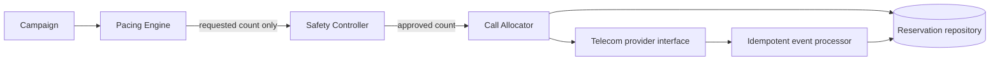
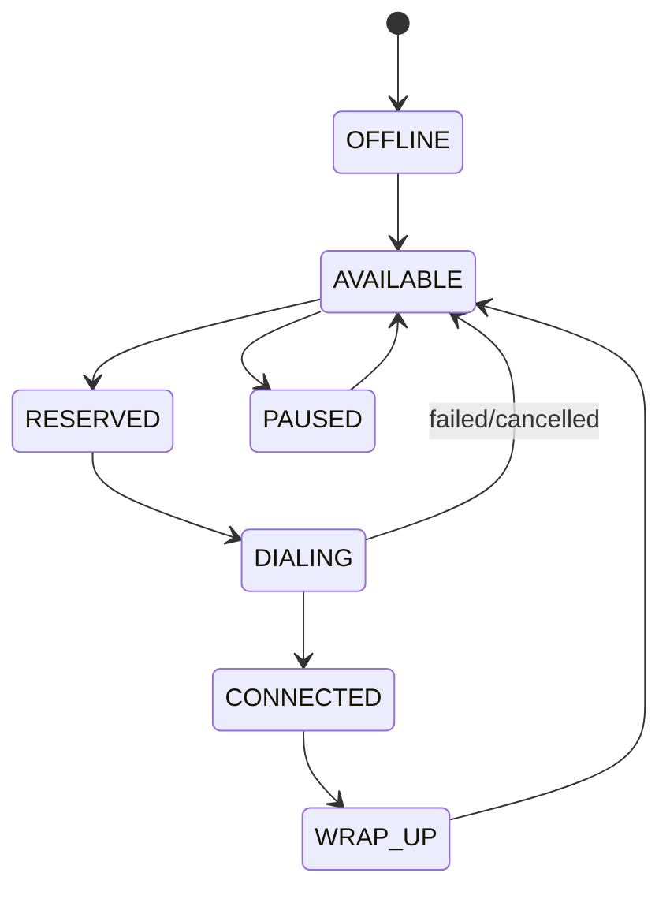
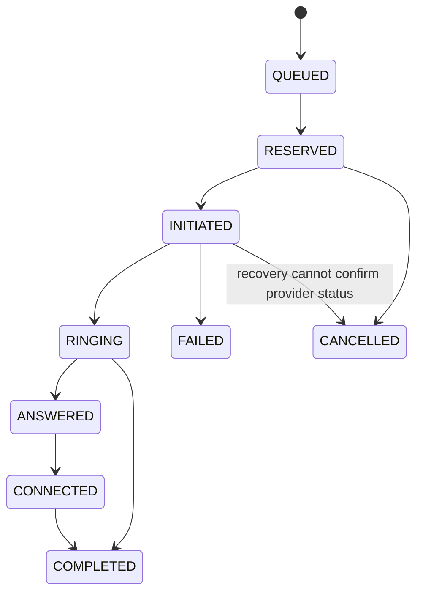

# Architecture decision record

## System shape

The prototype uses Python and the standard library. `InMemoryRepository` demonstrates the invariant in one process; `SqliteReservationStore` demonstrates the same agent + borrower reservation in a durable `BEGIN IMMEDIATE` transaction across separate store instances. In production, use a database transaction with conditional `UPDATE ... WHERE state = 'available'`, a row/version check, and a uniqueness constraint on active agent/lead reservations. The database is authoritative; cache is only a derived, discardable read model.

## State machines

### Agent

### Call

The processor accepts terminal `COMPLETED` safely from an in-flight state, because a provider may deliver events out of order. It records every event ID and rejects duplicates. Once terminal, all later events are no-ops. An `ANSWERED` event changes the agent to `CONNECTED` only when its reservation belongs to that call.

## Pacing and deterministic safety

The pacer starts at 1.0 calls per available agent and adjusts its proposal by 0.25 based on observed abandonment and answer rate. It caps at 3.5x as a proposal, backs off at 75% of the abandon threshold, and returns to 1.0 when the threshold is crossed or answer rate collapses. The simulator models setup time, talk time, and agent occupancy in 30-second turns; an agent has a known `release_turn` while connected.

The Safety Controller independently checks provider health and abandon rate. It records each decision and may approve, reduce, reject, or fall back to progressive behavior. A token is either an available agent or an already-bound, imminent agent release whose scheduled completion occurs before the provider's scheduled answer event. Thus a predictive call is allowed only when it has deterministic coverage, not merely a statistical forecast.

## Failure walkthroughs

| Situation | Result |
| --- | --- |
| Two workers race for one agent/borrower | The repository's atomic compare-and-set yields one winner. |
| Worker crashes after initiation | On restart, `recover()` queries provider status first, processes any authoritative events, then cancels and releases only an unresolved reservation. |
| Provider starts timing out | Circuit breaker marks it unhealthy; new requests are rejected if no provider is healthy. Existing calls are reconciled, not blindly retried. |
| 40 of 100 agents go offline | `mark_agents_unavailable()` immediately removes them from capacity and cancels only pre-connect calls bound to those agents. |
| Duplicate or out-of-order events | Event IDs and terminal-state rules make them idempotent no-ops or safe terminal transitions. |

Definite pre-connect provider failures retry once through a different healthy provider. Unknown initiation timeouts must instead query the provider by idempotency key before any retry, so the borrower is never redialed blindly.

## Mock providers and validation

Provider A is fast and reliable. Provider B has a higher failure rate and delivers duplicates/out-of-order events. Tests cover lifecycle preservation, capacity, DNC/hours, concurrent in-memory and SQLite reservations, retry/failover, agent drops, event idempotency, worker recovery, provider outage, and end-to-end abandonment fallback. `scripts/load_test.py` is a reproducible 10,000-lead / 1,000-agent in-process smoke test, not a claims-of-production performance benchmark.

## Scale plan

The first bottleneck at 10,000 agents is the single in-memory lock and linear scan for an available agent. Move state to a relational primary store, partition campaigns, allocate agents with indexed conditional writes, and deliver provider events through a durable queue keyed by call ID. Use an outbox for exactly-once *intent* publication and idempotent consumers for at-least-once delivery. Pacing metrics can be sharded/aggregated by campaign. These changes preserve the same safety invariant instead of merely adding servers.

## Final answer

I would let predictive pacing estimate demand aggressively, but make it advisory. A separate, durable Safety Controller should admit a call only when it can attach a real connection token: an available agent now, or a conservatively reserved near-term release slot. That keeps the utilization benefit in the prediction and scheduling layer while preserving the progressive dialer's deterministic guarantee that an answered call has an agent. When telemetry, provider health, or agent presence becomes uncertain, reduce immediately to currently available tokens rather than trusting the prediction.
